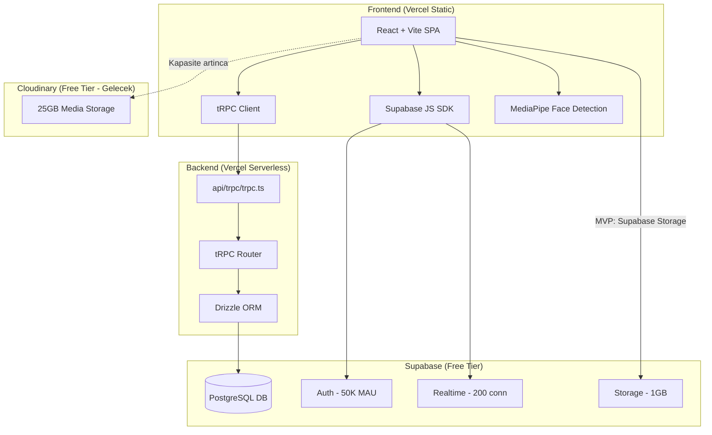

# Escilan Platformu: Mock'tan Gercek MVP'ye Gecis Plani

## Plan Karsilastirmasi ve Onerim

Iki farkli yaklasim analiz edildi:

| Kriter | Yaklasim A | Yaklasim B | Secim |
|--------|-----------|-----------|-------|
| Faz yapisi | 5 ana faz, ust seviye | 9 detayli faz (0-8) | **B** - Daha kontrollü ilerleme |
| Medya depolama | Cloudinary (25GB free) | Supabase Storage (1GB) | **A** - Daha fazla kapasite |
| Yuz maskeleme | Cloudinary API (`e_blur_faces`) | MediaPipe client-side | **B** - Ucretsiz, veri disari cikmaz |
| Detay seviyesi | Genel yonlendirme | Dosya/satir bazli referanslar | **B** - Uygulanabilirlik yuksek |
| Auth | Supabase Auth | Supabase Auth | **Ortak** |
| Mesajlasma | Supabase Realtime | Supabase Realtime | **Ortak** |
| Backend | Vercel Serverless | Vercel Serverless | **Ortak** |

**Onerim:** Yaklasim B'nin detayli faz yapisi + Yaklasim A'nin Cloudinary depolama stratejisi birlestirildi. Yuz maskeleme icin gizlilik sebebiyle client-side MediaPipe tercih edildi (escort fotograflari 3. parti sunucuya gitmez).

---

## Mimari Genel Bakis

---

## FAZ 0: Mimari Temel - Backend Hosting Sorununun Cozumu

**Sorun:** tRPC server-side procedure'lar var ama proje pure SPA olarak build ediliyor. Backend yok.

**Cozum:** Vercel Serverless Functions ile tRPC endpoint'i olusturma.

### Adimlar:
1. **`api/trpc/[trpc].ts` olustur** (YENi DOSYA)
   - Vercel Serverless Function olarak tRPC handler
   - `@trpc/server/adapters/standalone` veya `@trpc/server/adapters/fetch` kullan
   - Supabase client ile DB baglantisi

2. **`vercel.json` guncelle**
   - `/api/trpc/*` → serverless function'a yonlendir
   - Mevcut guvenlik header'larini koru, Supabase domain'lerini CSP'ye ekle

3. **`vite.config.ts` guncelle**
   - Dev proxy ekle: `/api` → localhost serverless function
   - Bundle optimizasyonu: `manualChunks` yapisini koru

4. **`package.json` guncelle**
   - `@vercel/node` dependency ekle
   - Build script'i kontrol et

5. **`src/lib/supabase.ts` duzelt**
   - `process.env` → `import.meta.env` (Vite browser ortami)

### Hedef Dosyalar:
| Dosya | Degisiklik |
|-------|-----------|
| `api/trpc/[trpc].ts` | **YENi** |
| `vercel.json` | GUNCELLE |
| `vite.config.ts` | GUNCELLE |
| `package.json` | GUNCELLE |
| `src/lib/supabase.ts` | DUZELT |

### Dogrulama:
- `npm run build` hatasiz tamamlanir
- `vercel dev` ile local serverless calisir
- tRPC client `/api/trpc` endpoint'ine basarili istek atar

---

## FAZ 1: Gercek Kimlik Dogrulama (Supabase Auth)

**Sorun:** `AuthContext.tsx` icinde `mock-admin-token` ve sahte auth servisi var. Frontend gercek auth'a bagli degil.

### Adimlar:
1. **Supabase Auth yapilandirmasi**
   - Supabase Dashboard: Email/Password auth aktif
   - Redirect URL'leri ayarla
   - User metadata'ya `role`, `name` ekle

2. **`src/contexts/AuthContext.tsx` yeniden yaz**
   - Mock `authService` tamamen kaldir
   - `supabase.auth.signInWithPassword()` entegre et
   - `supabase.auth.signUp()` ile kayit (metadata: `{ role, name }`)
   - `supabase.auth.onAuthStateChange()` listener ekle
   - Roller: `customer`, `escort`, `admin`
   - `isSuperAdmin`, `permissions`, `viewRole` yapisini koru

3. **tRPC `protectedProcedure` guncelle** (`src/lib/routers.ts`)
   - Request header'dan JWT al
   - `supabase.auth.getUser(token)` ile dogrula
   - `ctx.user` olarak context'e aktar

4. **Login/Register sayfalari guncelle**
   - `src/pages/Login.tsx` → Supabase Auth SDK
   - `src/pages/ClientLogin.tsx` → gercek form submission
   - Kayit sayfasi → rol secimi + Supabase signUp

5. **User tablosu senkronizasyonu**
   - `auth.users` → `public.users` trigger/webhook
   - Kayit sonrasi `escort_profiles` veya `customer_profiles` olustur

### Hedef Dosyalar:
| Dosya | Degisiklik |
|-------|-----------|
| `src/contexts/AuthContext.tsx` | YENIDEN YAZ |
| `src/lib/routers.ts` | protectedProcedure GUNCELLE |
| `src/pages/Login.tsx` | GUNCELLE |
| `src/pages/ClientLogin.tsx` | GUNCELLE |
| `src/lib/supabase.ts` | Auth helper ekle |

### Dogrulama:
- Gercek email ile kayit olunabilir
- Login sonrasi JWT token alinir
- Korunmus sayfalar yetkisiz erisimde redirect eder
- tRPC korunmus endpoint'ler 401 dondurur (tokensiz)

---

## FAZ 2: Gercek Katalog ve Profil Sistemi

**Sorun:** `MockListingService` statik veri donduruyor. Escort profilleri DB'den gelmiyor.

### Adimlar:
1. **Veritabani semasini genislet** (`src/drizzle/schema.ts`)
   - `escort_profiles`: `slug`, `services`, `languages`, `rates`, `privacy_level` ekle
   - `appointments` tablosu olustur (EKSIK)
   - Migration calistir: `npm run db:migrate`

2. **Isim gizlilik sistemi implementasyonu**
   - `privacy_level` enum: `full` | `partial` | `hidden`
   - `full`: "Ahmet Yilmaz"
   - `partial`: "Ahmet Y*****"
   - `hidden`: "A***** Y*****"
   - Profil ayarlarindan kullanici secer
   - Gosterim icin utility fonksiyonu: `formatDisplayName(name, level)`

3. **tRPC Catalog router genislet** (`src/lib/routers.ts`)
   - `catalog.list`: Filtreleme, pagination, siralama (gercek DB query)
   - `catalog.getBySlug`: Slug ile profil detay
   - `catalog.search`: Metin arama
   - `catalog.getFeatured`: One cikan ilanlar

4. **Frontend entegrasyonu**
   - `src/services/listingService.ts` → tRPC query'lere yonlendir veya kaldir
   - `src/pages/EscortList.tsx` → `trpc.catalog.list.useQuery()`
   - `src/pages/EscortProfile.tsx` → `trpc.catalog.getBySlug.useQuery()`
   - `AdvancedFilter.tsx` → gercek filtre parametreleri

5. **Seed data** (`scripts/migrate.ts`)
   - Test icin 10-20 ornek escort profili

### Hedef Dosyalar:
| Dosya | Degisiklik |
|-------|-----------|
| `src/drizzle/schema.ts` | GENISLET |
| `src/lib/routers.ts` | catalog router GENISLET |
| `src/services/listingService.ts` | DEPRECATE veya ADAPTER |
| `src/pages/EscortList.tsx` | tRPC ENTEGRE |
| `src/pages/EscortProfile.tsx` | tRPC ENTEGRE |
| `src/utils/formatName.ts` | **YENi** |

### Dogrulama:
- Escort listesi DB'den geliyor
- Filtreleme/arama calisiyor
- Profil detay sayfasi gercek veri gosteriyor
- Isim gizlilik seviyeleri dogru calisiyor

---

## FAZ 3: Gercek Zamanli Mesajlasma (Supabase Realtime)

**Sorun:** `mockWebSocket.ts` ve `useChat.ts` tamamen sahte. Gercek mesajlasma yok.

### Adimlar:
1. **DB tabloları guncelle**
   - `conversations`: `last_message`, `last_message_at`, `unread_count` ekle
   - `messages`: `status` (sent/delivered/read), `type` (text/image/system) ekle
   - Supabase RLS policies: Kullanici sadece kendi konusmalarini gorsun

2. **Messages tRPC router olustur**
   - `messages.getConversations`: Kullanicinin tum konusmalari
   - `messages.getMessages`: Konusma icindeki mesajlar (pagination)
   - `messages.send`: Yeni mesaj gonder
   - `messages.markAsRead`: Okundu bilgisi

3. **Supabase Realtime entegrasyonu**
   - `useChat` hook'u yeniden yaz
   - `supabase.channel('messages').on('postgres_changes', ...)` ile canli dinleme
   - Typing indicator icin Presence API
   - Online/offline durum takibi

4. **`mockWebSocket.ts` deprecate et**

5. **Chat UI guncelle**
   - `ChatInterface.tsx` → gercek veri
   - `MessageBubble.tsx` → durum ikonlari (gonderildi/okundu)
   - Musteri paneline Mesajlar sekmesi ekle

### Hedef Dosyalar:
| Dosya | Degisiklik |
|-------|-----------|
| `src/drizzle/schema.ts` | conversations/messages GUNCELLE |
| `src/lib/routers.ts` | messages router **YENi** |
| `src/hooks/useChat.ts` | YENIDEN YAZ |
| `src/services/mockWebSocket.ts` | DEPRECATE |
| `src/components/ChatInterface.tsx` | GUNCELLE |
| `src/pages/customer/CustomerMessages.tsx` | **YENi** |

### Dogrulama:
- Iki kullanici arasi gercek zamanli mesaj gidip geliyor
- Mesaj durumu (gonderildi/okundu) guncelleniyor
- Typing indicator calisiyor
- Sadece kendi konusmalarini goruyor (RLS)

---

## FAZ 4: Randevu Sistemi

**Sorun:** Appointments tablosu ve is akisi eksik. Dashboard'lar mock veri gosteriyor.

### Adimlar:
1. **`appointments` tablosu olustur** (schema.ts'de eksik)
   - `id`, `customer_id`, `escort_id`, `date`, `time_slot`, `status`, `notes`, `created_at`
   - Status enum: `pending` | `confirmed` | `cancelled` | `completed`

2. **Appointments tRPC router**
   - `appointments.create`: Musteri randevu talebi olusturur
   - `appointments.list`: Rola gore randevulari listele
   - `appointments.update`: Durum guncelle (onayla/reddet)
   - `appointments.cancel`: Iptal et

3. **Bildirim mantigi**
   - Ilk 10 bildirim ucretsiz (escort basina sayac)
   - `notification_count` alani escort_profiles'a ekle
   - Browser Push Notification (Service Worker uzerinden)
   - Admin paneline yeni randevu bildirimi

4. **UI entegrasyonu**
   - `src/pages/dashboard/ScheduleManager.tsx` → gercek tRPC
   - `src/pages/dashboard/InteractionsCenter.tsx` → gercek randevu listesi
   - `src/pages/customer/CustomerAppointments.tsx` → gercek veri
   - Musteri: randevu olustur butonu EscortProfile'a ekle

### Hedef Dosyalar:
| Dosya | Degisiklik |
|-------|-----------|
| `src/drizzle/schema.ts` | appointments tablosu **YENi** |
| `src/lib/routers.ts` | appointments router **YENi** |
| `src/pages/dashboard/ScheduleManager.tsx` | tRPC ENTEGRE |
| `src/pages/dashboard/InteractionsCenter.tsx` | tRPC ENTEGRE |
| `src/pages/customer/CustomerAppointments.tsx` | tRPC ENTEGRE |
| `src/pages/EscortProfile.tsx` | Randevu butonu EKLE |

### Dogrulama:
- Musteri randevu talebi olusturabiliyor
- Escort panelinde randevu gorunuyor
- Onay/red/iptal calisiyor
- Bildirim sayaci dogru calisiyor

---

## FAZ 5: Medya Yukleme ve AI Yuz Maskeleme

**Sorun:** Dosya yukleme servisi yok. AI gorsel duzenleyici sadece UI mockup.

### Adimlar:
1. **Supabase Storage yapilandirma**
   - `escort-photos` bucket olustur (public read, auth write)
   - RLS: Escort sadece kendi dosyalarini yukleyebilir
   - Max dosya boyutu: 5MB (sunucu tarafli)
   - MVP icin yeterli (1GB = ~2000 foto = ~200 escort)

2. **Upload servisi olustur** (`src/services/uploadService.ts` - YENi)
   - Client-side resize: max 1200px genislik
   - WebP format donusumu (browser Canvas API)
   - Max 500KB/fotograf hedefi
   - Supabase Storage'a upload
   - Kameradan cekme destegi (`navigator.mediaDevices.getUserMedia`)

3. **AI Yuz Maskeleme (MediaPipe)**
   - `@mediapipe/face_detection` entegrasyonu
   - Client-side calisir (fotograf 3. partiye gitmez - gizlilik)
   - Canvas API ile yuz bolgesine Gaussian blur
   - Kullanici: mask bolgesini ayarlayabilir
   - `src/pages/dashboard/ImageEditor.tsx` gercek hale getir

4. **Admin medya onay akisi**
   - Yuklenen medya `pending` durumunda baslar
   - Admin panelinde onay/red
   - Onaylanan medya public olur
   - `src/pages/admin/AdminMediaApprovals.tsx` gercek veri

5. **Galeri yonetimi**
   - Escort dashboard'da galeri yukleme/silme
   - Siralama (drag & drop)
   - Max 10 fotograf/escort (storage butcesi)

### Hedef Dosyalar:
| Dosya | Degisiklik |
|-------|-----------|
| `src/services/uploadService.ts` | **YENi** |
| `src/pages/dashboard/ImageEditor.tsx` | GERCEK HALE GETIR |
| `src/pages/dashboard/ProfileEditor.tsx` | Upload ENTEGRE |
| `src/pages/admin/AdminMediaApprovals.tsx` | tRPC ENTEGRE |
| `src/drizzle/schema.ts` | escort_photos GUNCELLE |
| `src/lib/routers.ts` | media router EKLE |

### Dogrulama:
- Escort galeri fotografi yukleyebiliyor
- Kameradan cekme calisiyor
- Yuz maskeleme gercekten blur uyguluyor
- Admin onay akisi calisiyor
- Dosya boyutu optimize ediliyor (< 500KB)

---

## FAZ 6: Performans ve Mobil Optimizasyon

**Sorun:** Three.js 3D efektler mobilde agir. Kullanicilar cogunlukla telefondan baglaniyor.

### Adimlar:
1. **3D bilesenleri kosullu yukle**
   - `SpaceBackground.tsx`: Mobilde (`window.innerWidth < 768`) CSS-only gradient arka plan
   - `Avatar3D`, `Card3D`: Mobilde statik gorsel/fallback
   - `React.lazy` + `<Suspense>` ile 3D sadece desktop'ta

2. **Bundle optimizasyonu**
   - `three` vendor chunk ayir (zaten var, dogrula)
   - `@mediapipe` lazy load
   - Tree shaking kontrol
   - Hedef: Ana chunk < 300KB gzipped

3. **Gorsel optimizasyon**
   - Tum gorseller lazy load (`loading="lazy"`)
   - WebP format onceligi
   - LQIP (Low Quality Image Placeholder)
   - Skeleton loading states (zaten var, entegre et)

4. **PWA iyilestirme**
   - `public/manifest.json` guncelle
   - `public/sw.js` → asset caching stratejisi guncelle
   - Offline fallback sayfasi

5. **Lighthouse hedefleri**
   - Mobile Performance > 75
   - FCP < 2s (3G mobil)
   - LCP < 3s

### Hedef Dosyalar:
| Dosya | Degisiklik |
|-------|-----------|
| `src/components/SpaceBackground.tsx` | KOSULLU YUKLEME |
| `src/components/3d/*.tsx` | LAZY LOAD |
| `vite.config.ts` | CHUNK OPTIMIZASYON |
| `public/manifest.json` | GUNCELLE |
| `public/sw.js` | GUNCELLE |

### Dogrulama:
- Lighthouse Mobile > 75
- 3D efektler mobilde yuklenmez
- Sayfa yuklenme < 3s (3G)
- PWA install edilebilir

---

## FAZ 7: Yasal Uyumluluk ve Gorunum

**Sorun:** 18+ dogrulama zayif, KVKK gorunumu eksik.

### Adimlar:
1. **18+ Yas Dogrulama guclendir**
   - `AgeVerification.tsx`: Dogum tarihi girisi + yas hesaplama
   - localStorage ile hatirla (tekrar sorma)
   - 18 yasindan kucukse erisim engelle

2. **KVKK / Gizlilik gorunumu**
   - `src/pages/PrivacyPolicy.tsx`: Profesyonel KVKK metni
   - `src/pages/TermsOfService.tsx`: Detayli kullanim kosullari
   - Cookie consent banner (KVKK uyumlu gorunum)
   - Veri isleme amaci aciklamasi

3. **Guvenlik header'lari**
   - CSP: Supabase domain'leri whitelist
   - HSTS, X-Frame-Options (mevcut, dogrula)
   - Rate limiting canli kontrol

4. **Iletisim ve sikayet**
   - `Contact.tsx` gercek form (email gonderimi)
   - Sikayet/ihbar mekanizmasi

### Hedef Dosyalar:
| Dosya | Degisiklik |
|-------|-----------|
| `src/components/AgeVerification.tsx` | GUCLENDIR |
| `src/pages/PrivacyPolicy.tsx` | ICERIK GUNCELLE |
| `src/pages/TermsOfService.tsx` | ICERIK GUNCELLE |
| `vercel.json` | CSP GUNCELLE |
| `src/components/CookieConsent.tsx` | **YENi** |

### Dogrulama:
- 18 yas alti giris yapamaz
- KVKK sayfasi profesyonel gorunuyor
- Cookie consent calisiyor
- Guvenlik header'lari dogru

---

## FAZ 8: Admin Paneli ve Gercek Analytics

**Sorun:** Admin dashboard mock istatistikler gosteriyor. Analytics rastgele veri uretiyor.

### Adimlar:
1. **Admin router genislet** (`src/lib/routers.ts`)
   - `admin.getDashboardStats`: Gercek DB'den KPI'lar
   - `admin.getUsers`: Kullanici listesi (pagination)
   - `admin.getPendingProfiles`: Onay bekleyenler
   - `admin.updateUserStatus`: Kullanici durum guncelle

2. **Dashboard gercek veri**
   - `src/pages/AdminDashboard.tsx` → tRPC query'ler
   - Toplam kullanici, aktif escort, bekleyen onay, gunluk kayit

3. **Analytics basitlestir**
   - `useAnalytics` → basit gercek metrikleri goster
   - Karmasik chart'lar MVP sonrasina birak
   - Temel: kayit sayisi, aktif kullanici, mesaj sayisi

4. **Musteri paneli eksik sekmeler**
   - `CustomerMessages.tsx` (Faz 3'te olusturuldu)
   - `CustomerSettings.tsx` → profil ayarlari, gizlilik seviyesi
   - `CustomerReviews.tsx` → MVP sonrasi (placeholder)

### Hedef Dosyalar:
| Dosya | Degisiklik |
|-------|-----------|
| `src/lib/routers.ts` | admin router GENISLET |
| `src/pages/AdminDashboard.tsx` | tRPC ENTEGRE |
| `src/hooks/useAnalytics.ts` | BASITLESIR |
| `src/pages/customer/CustomerSettings.tsx` | **YENi** |

### Dogrulama:
- Admin dashboard gercek sayilar gosteriyor
- Kullanici yonetimi calisiyor
- Profil onay/red akisi calisiyor

---

## Adim → Hedef → Dogrulama Izlenebilirlik Tablosu

| Faz | Ana Hedef | Kritik Dosyalar | Dogrulama Kriteri |
|-----|----------|----------------|-------------------|
| 0 | Backend hosting cozumu | `api/trpc/[trpc].ts`, `vercel.json` | tRPC endpoint calisiyor |
| 1 | Gercek auth | `AuthContext.tsx`, `routers.ts` | Email ile kayit/giris yapilabiliyor |
| 2 | Gercek katalog | `schema.ts`, `EscortList.tsx` | DB'den escort listesi geliyor |
| 3 | Gercek mesajlasma | `useChat.ts`, `ChatInterface.tsx` | Canli mesaj gidip geliyor |
| 4 | Randevu sistemi | `schema.ts`, `ScheduleManager.tsx` | Randevu olustur/onayla calisiyor |
| 5 | Medya yukleme + AI | `uploadService.ts`, `ImageEditor.tsx` | Fotograf yukleme + yuz blur calisiyor |
| 6 | Mobil performans | `SpaceBackground.tsx`, `vite.config.ts` | Lighthouse Mobile > 75 |
| 7 | Yasal gorunum | `AgeVerification.tsx`, `PrivacyPolicy.tsx` | 18+ kontrol + KVKK sayfasi tamam |
| 8 | Admin + analytics | `AdminDashboard.tsx`, `routers.ts` | Gercek istatistikler gorunuyor |

## MVP Tamamlanma Kriterleri (Definition of Done)

- [ ] Gercek email ile kayit/giris yapilabiliyor
- [ ] Escort katalogu DB'den yukleniyor, filtre/arama calisiyor
- [ ] Profil detay sayfasi gercek veri gosteriyor
- [ ] Platform ici mesajlasma gercek zamanli calisiyor
- [ ] Randevu sistemi fonksiyonel (olustur/onayla/iptal)
- [ ] Escort fotograf yukleyebiliyor ve yuz maskeleme calisiyor
- [ ] Mobil Lighthouse skoru > 75
- [ ] 18+ yas dogrulama calisiyor
- [ ] KVKK ve kullanim kosullari sayfalari profesyonel
- [ ] Admin paneli gercek verilerle calisiyor
- [ ] Vercel'e basariyla deploy edilebiliyor
- [ ] `npm run build` hatasiz tamamlaniyor

## Ucretsiz Tier Limitleri ve Kapasite

| Servis | Limit | Yeterlilik |
|--------|-------|-----------|
| Supabase DB | 500MB | ~50K kullanici + mesajlar icin yeterli |
| Supabase Storage | 1GB | ~200 escort profili (10 foto/escort, 500KB/foto) |
| Supabase Auth | 50K MAU | MVP icin fazlasiyla yeterli |
| Supabase Realtime | 200 es zamanli | MVP icin yeterli |
| Vercel | 100GB bandwidth | Orta trafik icin yeterli |

> **Not:** Kapasite asildikca Cloudinary (25GB free) medya depolama alternatifi olarak devreye alinabilir.
