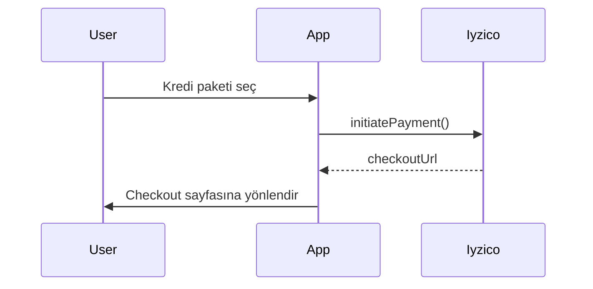
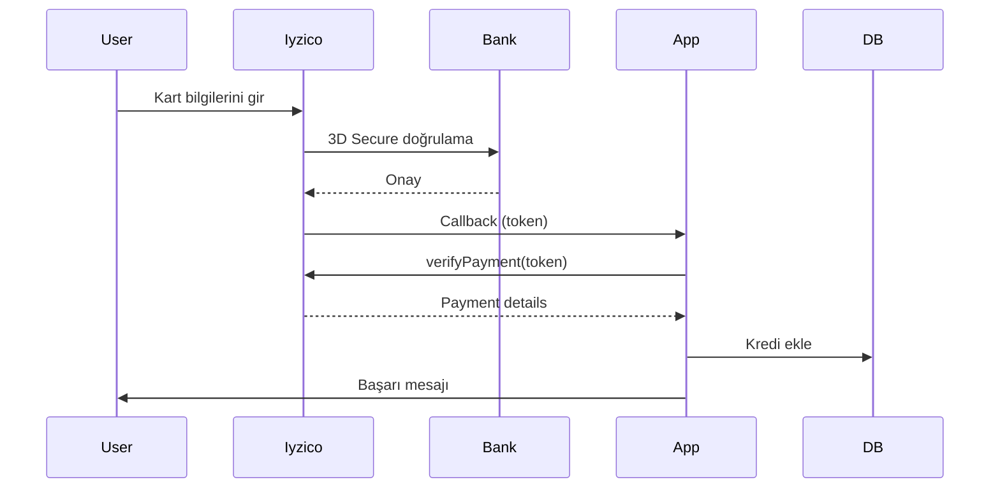
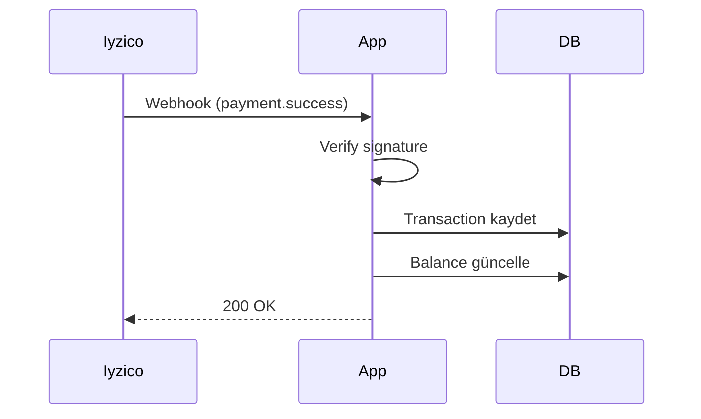

# Payment Integration Module

Escort platformu için Iyzico ödeme entegrasyonu modülü.

## 📁 Dosya Yapısı

```
src/lib/payment/
├── types.ts       # TypeScript tip tanımlamaları
├── iyzico.ts      # Iyzico API client
├── utils.ts       # Yardımcı fonksiyonlar
├── webhooks.ts    # Webhook handler
└── README.md      # Bu dosya
```

## 🚀 Hızlı Başlangıç

### Environment Variables

`.env` dosyanıza ekleyin:

```bash
# Iyzico API Credentials
IYZICO_API_KEY=your_api_key_here
IYZICO_SECRET_KEY=your_secret_key_here
IYZICO_BASE_URL=https://sandbox-api.iyzipay.com  # veya production URL
IYZICO_WEBHOOK_SECRET=your_webhook_secret_here

# App URL
VITE_APP_URL=http://localhost:3000
```

### Temel Kullanım

```typescript
import { IyzicoClient } from '@/lib/payment/iyzico';
import { formatPrice } from '@/lib/payment/utils';

// Client oluştur
const iyzicoClient = new IyzicoClient();

// Ödeme başlat
const payment = await iyzicoClient.initiatePayment({
  amount: 50000, // 500 TL (kuruş cinsinden)
  currency: 'TRY',
  description: 'VIP Üyelik - 1 Ay',
  userId: 123,
  packageId: 'vip-monthly',
  callbackUrl: 'https://yoursite.com/payment/callback',
});

if (payment.success) {
  // Kullanıcıyı checkout sayfasına yönlendir
  window.location.href = payment.checkoutUrl;
}
```

## 📋 Özellikler

### 1. Ödeme İşlemleri

- ✅ Kredi kartı ödemeleri
- ✅ 3D Secure desteği
- ✅ Taksit seçenekleri
- ✅ Ödeme doğrulama
- ✅ İade işlemleri

### 2. Tip Güvenliği

Tüm ödeme işlemleri için TypeScript type definitions:

```typescript
import type {
  PaymentRequest,
  PaymentResponse,
  PaymentStatus,
  CreditPackage,
} from '@/lib/payment/types';
```

### 3. Utility Fonksiyonlar

```typescript
import {
  formatPrice,
  convertToSmallestUnit,
  validateAmount,
  calculateDiscount,
  validateCardNumber,
  maskCardNumber,
} from '@/lib/payment/utils';

// Fiyat formatlama
formatPrice(50000, 'TRY'); // "500,00 TL"

// Para birimi dönüşümü
convertToSmallestUnit(500); // 50000 kuruş

// İndirim hesaplama
calculateDiscount(100000, 20); // 80000 (20% indirim)

// Kart numarası validasyonu
validateCardNumber('4242424242424242'); // true

// Kart numarası maskeleme
maskCardNumber('4242424242424242'); // "************4242"
```

### 4. Webhook Handling

```typescript
import { handlePaymentWebhook } from '@/lib/payment/webhooks';

// Webhook endpoint'inde
app.post('/api/payment/webhook', async (req, res) => {
  const result = await handlePaymentWebhook(
    req.body,
    req.headers,
    {
      secretKey: process.env.IYZICO_WEBHOOK_SECRET,
      allowedIPs: ['185.86.130.0/24'], // Iyzico IP range
    }
  );

  res.status(result.success ? 200 : 400).json(result);
});
```

## 🔐 Güvenlik

### Webhook Doğrulama

Webhook'lar aşağıdaki güvenlik kontrollerinden geçer:

1. **Signature Verification**: HMAC-SHA256 imza doğrulaması
2. **IP Whitelist**: Sadece Iyzico IP'lerinden gelen istekler kabul edilir
3. **Payload Validation**: Gelen veri yapısı doğrulanır

### PCI-DSS Uyumluluğu

- ❌ Kart bilgileri asla sunucuda saklanmaz
- ✅ Tüm ödeme işlemleri Iyzico üzerinden yapılır
- ✅ 3D Secure zorunlu
- ✅ SSL/TLS şifrelemesi

## 💳 Ödeme Akışı

### 1. Ödeme Başlatma



### 2. Ödeme İşleme



### 3. Webhook İşleme



## 📦 Kredi Paketleri

Örnek paket tanımlamaları:

```typescript
const creditPackages: CreditPackage[] = [
  {
    id: 'credits-100',
    name: '100 Kredi',
    credits: 100,
    price: 10000, // 100 TL
    currency: 'TRY',
  },
  {
    id: 'credits-500',
    name: '500 Kredi',
    credits: 500,
    price: 45000, // 450 TL (10% indirim)
    currency: 'TRY',
    discount: 10,
    popular: true,
  },
  {
    id: 'credits-1000',
    name: '1000 Kredi',
    credits: 1000,
    price: 80000, // 800 TL (20% indirim)
    currency: 'TRY',
    discount: 20,
  },
];
```

## 🧪 Test Kartları (Sandbox)

Iyzico sandbox ortamında test için:

| Kart Numarası      | Sonuç    | 3D Secure |
|-------------------|----------|-----------|
| 5528790000000008  | Başarılı | Evet      |
| 4242424242424242  | Başarılı | Hayır     |
| 5406675406675403  | Hatalı   | Evet      |

**CVV:** Herhangi 3 rakam  
**Son Kullanma:** Gelecekteki herhangi bir tarih  
**3D Şifresi:** 123456

## ⚠️ Önemli Notlar

### Development

- Sandbox URL kullanın: `https://sandbox-api.iyzipay.com`
- Test API key/secret kullanın
- Test kartlarıyla ödeme yapın

### Production

- Production URL'e geçin: `https://api.iyzipay.com`
- Gerçek API credentials kullanın
- SSL sertifikası zorunlu
- Webhook URL'i Iyzico panelinden tanımlayın

## 🔗 Kaynaklar

- [Iyzico API Dokümantasyonu](https://dev.iyzipay.com/)
- [Iyzico Node.js SDK](https://github.com/iyzico/iyzipay-node)
- [PCI-DSS Compliance](https://www.pcisecuritystandards.org/)

## 📞 Destek

Ödeme entegrasyonu ile ilgili sorular için:

- Iyzico Destek: destek@iyzico.com
- Iyzico Telefon: 0850 222 0 998
